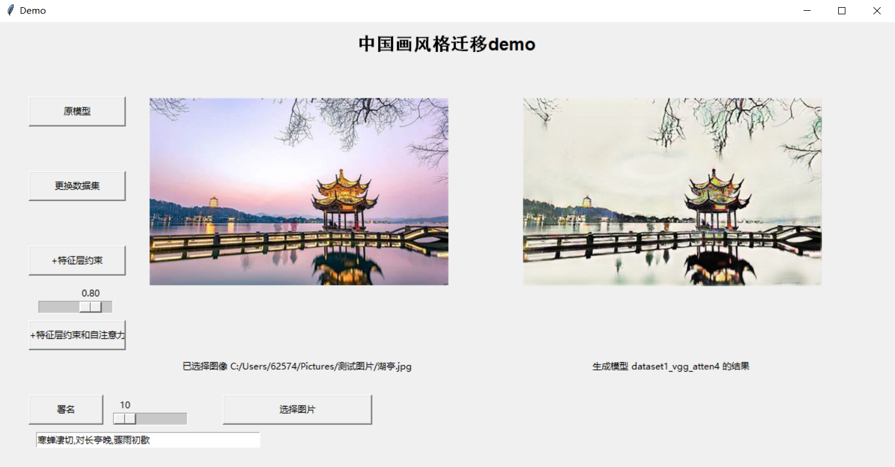
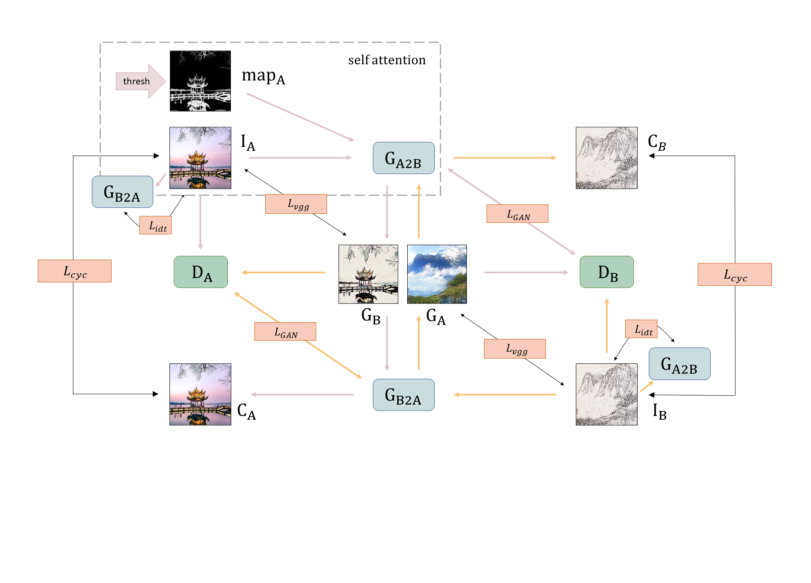
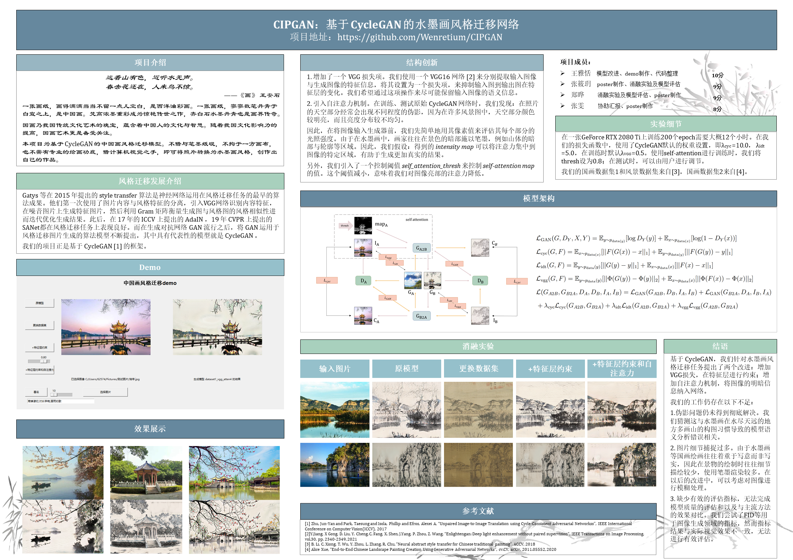

# CIPGAN

### Introduction

> 画 王安石
>
> 远看山有色，近听水无声。
>
> 春去花还在，人来鸟不惊。

一张画纸，画得满满当当不留一点儿空白，是西洋油彩画。一张画纸，寥寥数笔丹青于白宣之上，是中国画。梵高浓墨重彩成为惊艳传世之作，齐白石水墨丹青也是画界传奇。

国画乃我国传统文化艺术的瑰宝，蕴含着中国人的文化与智慧。随着我国文化影响力的提高，国画艺术更是备受关注。

本项目为基于CycleGAN的中国画风格迁移模型。不借与笔墨纸砚，不拘于一方画布，也不需有专业的绘画功底，借计算机视觉之手，即可将照片转换为水墨画风格，创作出自己的作品。


### Getting Started
- Clone this repo:
```bash
git clone https://github.com/Wenretium/CIPGAN
cd CIPGAN
```

- type the command `pip install -r requirements.txt`.

- You may meet some errors when following the provided file requirements.txt. Actually most of the default downloading versions of pytorch-gpu is available. Here's my environment and hope it helps.  (The pretrained models provided are trained on Ubuntu system.)

  ```
  # Windows 10
  python==3.7
  torch==1.8.1+cu102
  torchvision==0.9.1+cu102
  dominate==2.6.0
  visdom==0.1.8
  opencv-python==4.5.2.54
  numpy==1.20.3
  pillow==8.2.0
  
  # Ubuntu 16.04
  python==3.6
  pytorch==1.4.0+cu101
  torchvision==0.5.0
  dominate==2.4.0
  visdom==0.1.8
  opencv-python==4.5.2.54
  numpy==1.16.4
  pillow==6.1.0
  ```

  

### Train
#### 1. Prepare a dataset including two different domains, and organize it as follows. (The same as CycleGAN)

```
CIP_dataset1_process
--trainA
--trainB
--testA
--testB
```
I also provide my own training dataset, including `CIP_dataset1_process` and `CIP_dataset2`. They’re collected by me from the Internet (sorry to forget the specific source). You can download it from [here](https://pan.baidu.com/s/1sWQwcun-lq0YEc-0WQRXAg) (203n).

#### 2. Train a model

+ original
```
python train.py --dataroot ./datasets/CIP_dataset1_process --name CIP_dataset1 
```
+ +vgg
```
python train.py --dataroot ./datasets/CIP_dataset1_process --name CIP_dataset1 --vgg
```
+ +vgg and attention (thresh is set to 0.8 by default)
```
python train.py --dataroot ./datasets/CIP_dataset1_process --name CIP_dataset1 --vgg --self_attention
```
+ To view training results and loss plots, run python -m visdom.server and click the URL http://localhost:8097.


### Test
+ without self-attention
```
python test.py --dataroot ./datasets/CIP_dataset1_process --name CIP_dataset1 
```
+ with self-attention (change `self_attention_thresh` here)
```
python test.py --dataroot ./datasets/CIP_dataset1_process --name CIP_dataset1 --self_attention --self_attention_thresh 0.8
```
If you don't want to resize the images when testing, add `--preprocess none` to the end.

The test results will be saved to a html file here: `./testresults/CIP_dataset1/latest_test/index.html`.


### Demo
We provide a test demo with a simple GUI. This part is located in  `./demo_files` and we provide 4 pretrained models for ablation study.

Run `./gui.py` and interact with our demo.



You can choose your own test image and get the result immediately. The results are saved in  `./demo_files/results`.


### Architecture

#### Overview




#### Contributes

We choose the famous unsupervised style transfer model CycleGAN as our baseline. To attain  a better visual performance,  we propose two improvements:

+ In addition to the original loss function,  we add a new VGG loss. We use a pretrained VGG16 model from EnlightenGAN to obtain feature information of the input image and the corresponding output image, and set it as a loss component to restrain the variation of them. By this means, we hope to retain the semantic informantion of the input image as much as possible.

+ When training and testing on the original networks design of CycleGAN, we notice that there are artifacts in different degrees in our results. They usually appear in the sky, in where colors are often light and have an uneven distribution. To restrain the appearance of artifacts, we apply self-attention to our networks.  

  Before the images are put into the generator, we get their maps at first. We simply use the pixel values of an image to evaluate its intensity. In Chinese ink paintings, painters prefer to apply the ink on the dark regions of a landscape, such as the dark region and the edges of a mountain. So, we suppose that an intensity map is helpful to attach the attention to the proper regions of an image, and thus provides a more authentic result.

  In addition, we provide a control factor `self_attention_thresh` . It controls the values of the self-attention map. When the value of it decreases, that means we pay less attention to the other light-color details of the image.  


### Our project

#### Poster



#### Supplemental material


### Updating

📌 March 27th, 2022: Update the source link of my dataset.

📌 April 12th, 2022: Update the formula figure and correct some typos.
